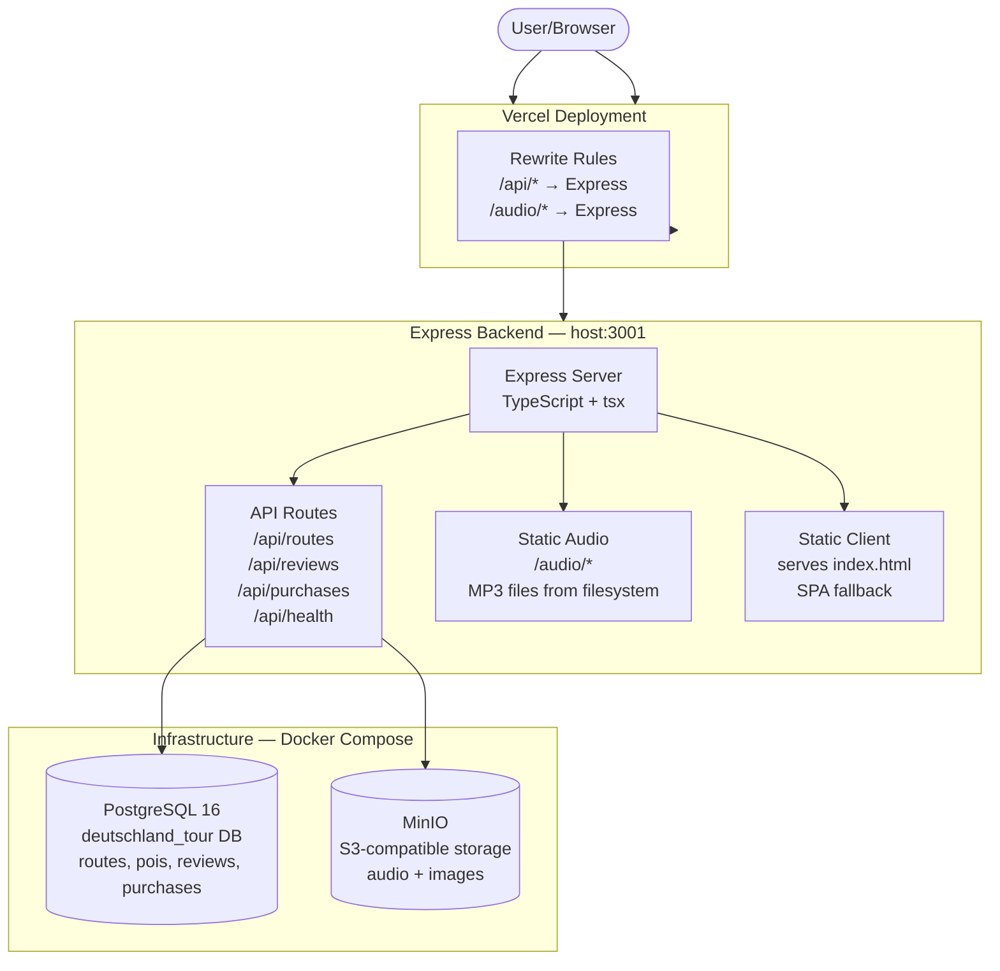
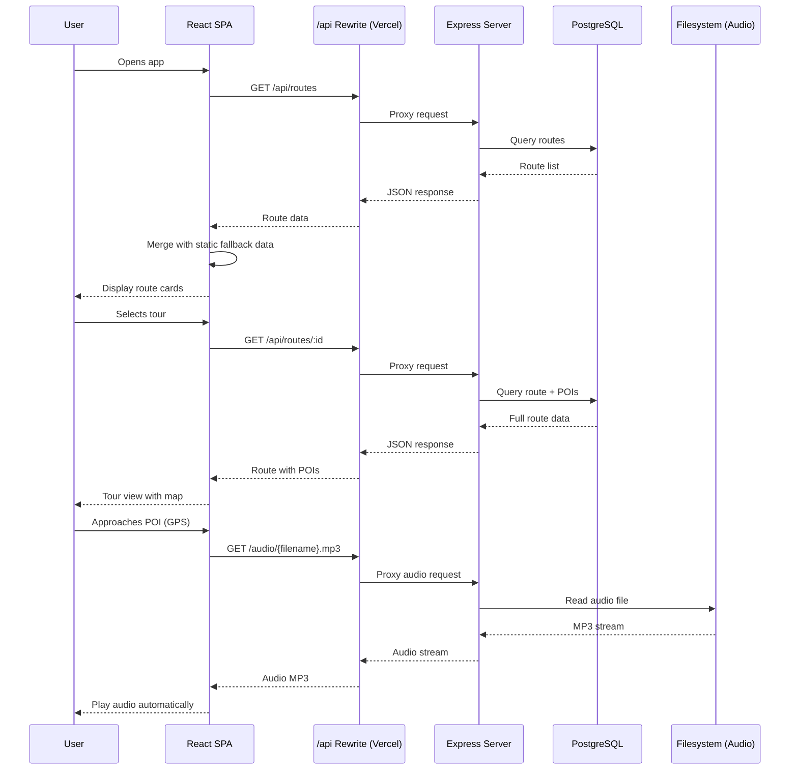

# 🇩🇪 Deutschland Tour

**Self-guided audio walking tours through Germany's most beautiful cities.**

Explore Berlin, Munich, Hamburg, Cologne, Dresden, Heidelberg, and Frankfurt with immersive GPS-triggered audio guides. No app installation required — just open the website and start walking.

---

## 🤖 Fully Vibecoded with Hermes Agent

This project was built entirely through natural language conversations with [Hermes Agent](https://hermes-agent.nousresearch.com) — an autonomous AI coding assistant. From architecture to deployment, every line of code was generated, tested, and deployed via voice and chat prompts.

---

## ✨ Features

- **🎧 GPS-Activated Audio** — Stories play automatically as you approach landmarks
- **🌐 Multi-Language** — German and English audio guides for every tour
- **🗺️ Interactive Map** — Real-time position tracking via Leaflet + OpenStreetMap
- **🖥️ Virtual Tours** — Browse any tour remotely without travelling
- **🧱 Route Builder (Baukasten)** — Create custom walking routes with your own POIs
- **⭐ Favorites** — Bookmark tours for quick access
- **🔍 Search** — Find tours by city or tag
- **💬 Reviews** — Read and leave ratings for tours
- **🌙 Dark Mode** — Toggle between light and dark themes
- **💯 Completely Free** — All tours, all features, no hidden costs
- **📱 PWA Ready** — Installable service worker for offline-capable experience
- **🚫 No Account Required** — Start immediately, no signup

---

## 🏙️ Available Tours

| City          | Route                     | Distance | Duration |
|---------------|---------------------------|----------|----------|
| Berlin        | Historical Walk           | 4.2 km   | ~120 min |
| München       | Old Town & Culture        | 3.1 km   | ~90 min  |
| Hamburg       | Harbor & History          | 3.5 km   | ~100 min |
| Köln          | Cathedral & Old Town      | 2.8 km   | ~80 min  |
| Dresden       | Altstadt & Baroque        | 3.0 km   | ~90 min  |
| Heidelberg    | Schloss & Altstadt        | TBD      | TBD      |
| Frankfurt     | Main & Skyline            | TBD      | TBD      |

---

## 🏗️ Architecture



### Data Flow



---

## 🛠️ Tech Stack

### Frontend
| Technology   | Purpose                  |
|-------------|--------------------------|
| React 18    | UI framework             |
| TypeScript  | Type safety              |
| Vite 6      | Build tool & dev server  |
| Leaflet     | Interactive maps         |
| OpenStreetMap | Map tile provider      |
| Vitest      | Unit & component tests   |

### Backend
| Technology   | Purpose                  |
|-------------|--------------------------|
| Express 4   | HTTP server              |
| TypeScript  | Type safety              |
| tsx         | Dev runner (watch mode)  |
| PostgreSQL  | Primary database         |
| pg          | PostgreSQL client        |
| Stripe      | Payment processing (legacy, disabled)|
| MinIO       | S3-compatible file storage for audio/images |

### Infrastructure
| Service     | Purpose                  |
|-------------|--------------------------|
| Vercel      | Frontend hosting & CDN   |
| Docker Compose | Local dev infra (Postgres + MinIO) |
| Service Worker | PWA offline capability |

---

## 🚀 Getting Started

### Prerequisites

- **Node.js** ≥ 18
- **npm** ≥ 9
- **Docker** & **Docker Compose** (for PostgreSQL + MinIO)

### 1. Clone & Install

```bash
git clone https://github.com/kvnlnk/deutschland-tour.git
cd deutschland-tour
npm install
```

### 2. Start Infrastructure

```bash
docker compose up -d
```

This starts:
- **PostgreSQL** on `localhost:5432` (database: `deutschland_tour`)
- **MinIO** on `localhost:9000` (API) and `localhost:9001` (Console)

> **Note:** MinIO needs a bucket named `audio` and `images`. Create them via the MinIO console at `http://localhost:9001` (login: `minioadmin` / `minioadmin2026`).

### 3. Seed the Database

```bash
# The database schema is auto-created on first server start.
# Seed scripts can be run from the server package:
cd server && npm run seed
```

### 4. Run Development Servers

```bash
# From project root — starts both client and server concurrently
npm run dev
```

This starts:
- **Frontend** → `http://localhost:5173` (Vite dev server)
- **Backend** → `http://localhost:3001` (Express with hot reload)

The Vite dev server proxies `/api/*` and `/audio/*` to the Express backend.

### 5. Open in Browser

```
http://localhost:5173
```

---

## 📁 Project Structure

```
deutschland-tour/
├── client/                          # React frontend
│   ├── public/                      # Static assets
│   │   ├── icons/                   # PWA app icons
│   │   ├── manifest.json            # PWA manifest
│   │   └── sw.js                    # Service worker
│   ├── src/
│   │   ├── components/              # React components
│   │   │   ├── NavBar.tsx           # Top navigation bar
│   │   │   ├── Hero.tsx             # Landing hero section
│   │   │   ├── TourView.tsx         # Main tour experience view (lazy loaded)
│   │   │   ├── RouteMap.tsx         # Leaflet map with POI markers
│   │   │   ├── AudioPlayer.tsx      # Audio playback controls
│   │   │   ├── POICard.tsx          # Point-of-interest card
│   │   │   ├── RoutePreview.tsx     # Tour preview modal
│   │   │   ├── PricingSection.tsx   # Pricing & purchase UI
│   │   │   ├── ReviewSection.tsx    # User reviews & ratings
│   │   │   ├── SearchBar.tsx        # Tour search input
│   │   │   ├── BaukastenPage.tsx    # Route builder (Baukasten)
│   │   │   ├── RouteEditor.tsx      # Custom route editor
│   │   │   ├── CustomRoutesPage.tsx # User-created routes listing
│   │   │   ├── TourCompletion.tsx   # Tour completion overlay
│   │   │   ├── FAQSection.tsx       # Frequently asked questions
│   │   │   ├── ImageWithFallback.tsx# Image with fallback placeholder
│   │   │   └── ErrorBoundary.tsx    # React error boundary
│   │   ├── hooks/                   # Custom React hooks
│   │   │   ├── useGeolocation.ts    # GPS position tracking
│   │   │   ├── useAudioPlayer.ts    # Audio playback state
│   │   │   ├── useProximityTracker.ts # GPS proximity detection
│   │   │   ├── useTourProgress.ts   # Tour completion tracking
│   │   │   ├── useFavorites.ts      # Tour favorites (localStorage)
│   │   │   ├── usePurchase.tsx      # Purchase flow (legacy)
│   │   │   ├── useDarkMode.ts       # Theme toggling
│   │   │   ├── useCustomRoutes.ts   # Custom route CRUD
│   │   │   └── useBaukasten.ts      # Route builder state
│   │   ├── data/                    # Static fallback tour data
│   │   │   ├── index.ts             # Data merge layer (API + fallback)
│   │   │   ├── berlin.ts            # Berlin tour data
│   │   │   ├── muenchen.ts          # Munich tour data
│   │   │   ├── hamburg.ts           # Hamburg tour data
│   │   │   ├── koeln.ts             # Cologne tour data
│   │   │   ├── dresden.ts           # Dresden tour data
│   │   │   └── heidelberg.ts        # Heidelberg preview data
│   │   ├── types/                   # TypeScript type definitions
│   │   │   └── index.ts             # Route, POI, Review, TourState types
│   │   ├── styles/                  # CSS styles
│   │   │   └── pricing.css          # Pricing page styles
│   │   ├── api.ts                   # API client (fetch wrappers)
│   │   ├── App.tsx                  # Root app component
│   │   ├── App.css                  # Global styles + dark mode
│   │   └── main.tsx                 # App entry point + SW registration
│   ├── index.html                   # HTML entry point
│   ├── vite.config.ts               # Vite config (proxy /api, /audio)
│   └── tsconfig.json                # TypeScript config
│
├── server/                          # Express backend
│   ├── audio/                       # Local MP3 audio files (dev)
│   ├── src/
│   │   ├── routes/
│   │   │   └── routes.ts            # API route handlers
│   │   ├── db.ts                    # PostgreSQL connection pool
│   │   └── index.ts                 # Express server entry point
│   ├── tsconfig.json
│   └── package.json
│
├── docker-compose.yml               # PostgreSQL + MinIO for local dev
├── vercel.json                      # Vercel deployment config
├── package.json                     # Root workspace config
└── README.md
```

---

## 🚢 Deployment

### Frontend (Vercel)

The project is configured for Vercel deployment via `vercel.json`:

```json
{
  "buildCommand": "cd client && npm run build",
  "outputDirectory": "client/dist",
  "installCommand": "cd client && npm install",
  "framework": "vite",
  "rewrites": [
    { "source": "/audio/(.*)", "destination": "http://<your-server>:3001/audio/$1" },
    { "source": "/api/(.*)", "destination": "http://<your-server>:3001/api/$1" },
    { "source": "/(.*)", "destination": "/index.html" }
  ]
}
```

1. Push to GitHub (`https://github.com/kvnlnk/deutschland-tour`)
2. Import project in Vercel
3. Set **Root Directory** to `./`
4. Vercel auto-detects `vercel.json` — no extra config needed
5. Update the rewrite destination IP in `vercel.json` to point to your Express server

### Backend (Self-Hosted)

The Express server runs on your own infrastructure:

```bash
cd server
npm install
npm run build
npm start  # Runs on port 3001
```

Recommended setup:
- **Process manager:** PM2 or systemd
- **Reverse proxy:** nginx or Caddy (TLS termination)
- **Database:** PostgreSQL 16 (cloud or self-hosted)
- **Storage:** MinIO or S3 for audio/image files

---

## 🔌 API Endpoints

| Method | Endpoint                      | Description               |
|--------|-------------------------------|---------------------------|
| GET    | `/api/routes`                 | List all routes           |
| GET    | `/api/routes/:id`             | Get route with full POIs  |
| GET    | `/api/reviews/:routeId`       | Get reviews for a route   |
| POST   | `/api/reviews`                | Submit a review           |
| POST   | `/api/create-checkout-session`| Stripe checkout (legacy)  |
| POST   | `/api/purchases`              | Log a purchase            |
| GET    | `/api/health`                 | Health check              |

---

---

## 📄 License

Open source. Free for personal and educational use.

---

## 🤝 Contributing

Conventional commits are encouraged. Fork the repo, make your changes, and open a pull request.

---

<p align="center">Made with ❤️ by <a href="https://github.com/kvnlnk">kvnlnk</a></p>
